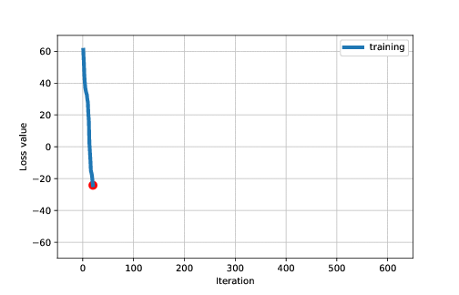

--------------------------------------------------------------------
Paper: 
A deep energy method for finite deformation hyperelasticity

Authors: Vien Minh Nguyen-Thanh, Xiaoying Zhuang, Timon Rabczuk

European Journal of Mechanics - A/Solids
Available online 25 October 2019, 103874
https://doi.org/10.1016/j.euromechsol.2019.103874

Contact: minh.nguyen@ikm.uni-hannover.de

Training loss of the Twisting T-structure example

Corresponding animation to the training loss
--------------------------------------------------------------------
Setup:
1. Create DeepEnergyMethod directory: cd \<workingdir\>; mkdir DeepEnergyMethod

2. Download dem_hyperelasticity source code and put it under DeepEnergyMethod.
The directory is like \<workingdir\>/DeepEnergyMethod/dem_hyperelasticity

3. Setup environment with conda: conda create -n demhyper python=3.7

4. Switch to demhyper environment to start working with dem: source activate demhyper

5. Install numpy, scipy, matplotlib: pip install numpy scipy matplotlib

6. Install pytorch and its dependencies: conda install pytorch; conda install pytorch-cpu torchvision-cpu -c pytorch

7. Install pyevtk for view in Paraview: pip install pyevtk

8. Setup PYTHONPATH environment by doing either a.(temporary use) or b.(permanent use): 

a. export PYTHONPATH="$PYTHONPATH:\<workingdir\>/DeepEnergyMethod"
  
b. add the above line to the end of file ~/.bashrc and execute "source ~/.bashrc"

Optional:

To use fem to compare the results with fem, we recommend to install fenics

1. conda config --add channels conda-forge

2. !conda install fenics
